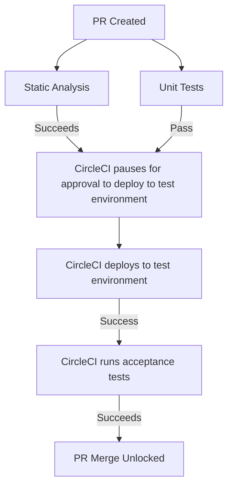
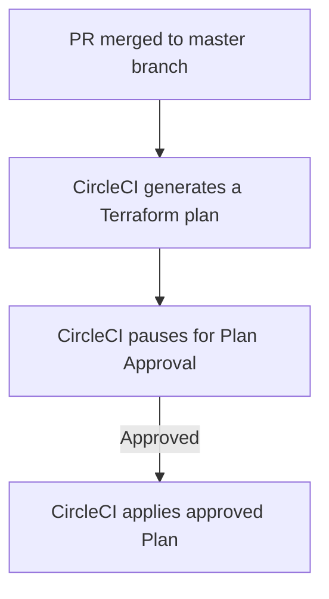

# Deploying with CircleCI

Deploying with CircleCI involves 2 workflows.

## PR Testing and Static Analysis

The first will handle all of the automated validation required to merge a pull request.

## Deployment to production

The second will handle deploying to production.

## More details

At this time, CircleCI should be reserved for large or complicated projects with special cases due to budget reasons.
